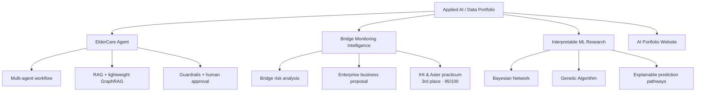
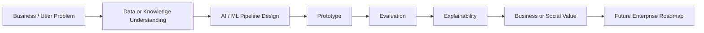

# Hi, I'm Ami 👋

## Applied AI / Data Enthusiast 

I am a Digital Business & Innovation student. 
I am learning advanced technologies to digitalize business operations and solve real business problems.

My current focus is **Data Analytics and Explanable- Practical AI systems for Enterprise Digital Transformation**.

My applied area is **customer analytics**, where I use data to understand customer behavior and support better business decisions.

My developing pathway is **Positive Computing and Cogitive Computing**  ===> build human-centered AI systems

[Alert!] I love diagram-- mindmap, therefore, most of the documents are filled with diagrams. Thank you!!!

---

<b>Technical Skills</b>

 

### AI / Data / Machine Learning

### RAG / AI Agents / Prototyping

### Business / Research Tools

---

<b>My Learning Journey</b>

 

> From Existing business Problem -> DIgital( AI) solutions -> Overall Business Digital transformation and achieve business goals

<table>
  <tr>
    <td width="22%"><b>Year 1</b> Technical Foundation</td>
    <td>
      <b>Python · R · Computer Networking · Business Principles </b> 
      Built my foundation in programming, statistical thinking, and basic system/network understanding.
    </td>
  </tr>

  <tr>
    <td width="22%"><b>Year 2</b> Data & Business Foundation</td>
    <td>
      <b>Statistics · Mathematics · Database_Big Data</b> 
      Developed core data analysis skills and learned how technology connects with business operations.
    </td>
  </tr>

  <tr>
    <td width="22%"><b>Career Practicum</b> Enterprise Experience</td>
    <td>
      <b>IHI & Aster internship-based project</b> 
      Worked as a <b>data analyst</b> on bridge risk analysis and business proposal development. 
      <b>Result:</b> Team ranked <b>3rd</b> and received <b>95/100</b>. 
      This experience helped me understand enterprise business problems, infrastructure risk, and data-driven proposal design.
    </td>
  </tr>

  <tr>
    <td width="22%"><b>Turning Point</b> AI Ethics & XAI</td>
    <td>
      <b>AI & Intelligent Product Development</b> 
      Became interested in AI ethics, Explainable AI, and human-centered AI systems.
    </td>
  </tr>

  <tr>
    <td width="22%"><b>Year 3</b> Early Graduation / Research</td>
    <td>
      <b>Bayesian Network + Genetic Algorithm for interpretable machine learning</b> 
      Started thesis research on interpretable ML and probabilistic reasoning. 
      <b>Status:</b> CIDM 2026 paper submitted; result pending.
    </td>
  </tr>

  <tr>
    <td width="22%"><b>Current Focus</b> Applied AI/Data</td>
    <td>
      <b>Mining Unstructured Data · Business Analytics & AI · Customer Analytics & AI · Generative AI and application</b> 
      Developing toward Applied AI for business digitalization, positive computing, ethical AI, and explainable AI/Data solutions.
    </td>
  </tr>
</table>

---

<b>Featured Projects</b>

 

### Safe Multi-Agent ElderCare Assistant
**Role:** Individual project  
**Focus:** Hybrid routing( ML-based + rule-based), RAG, lightweight GraphRAG, memory, guardrails and caregiver escalation

**Value:** Supports elderly users with safer, explainable next-step guidance.
**Link:** [View project repository](https://github.com/Ami14123/Explanable-Eldercare-Agent/tree/feature/xai-explanations)

### Bridge Monitoring Intelligence
**Role:** Collaborated project / IHI & Aster Career Practicum  
**Focus:** Bridge risk analysis, inspection prioritization, and business proposal  
**Result:** Data analyst role. Team received **95/100**.
**Link:** [View project repository](https://github.com/Ami14123/Bridge_risk_detection_for_IHI_corp)

### Interpretable ML Research: Bayesian Network + Genetic Algorithm
**Role:** Collaborated research project / thesis direction  
**Focus:** Interpretable machine learning, probabilistic reasoning, and explainable prediction pathways  
**Status:** Paper submitted to **ICDM 2026**; result pending.

---

<b>Other Class Projects</b>

 

| Project | Role | Focus | Result |
|---|---|---|---|
| **Restaurant Review Intelligence** | Class project | NLP, TF-IDF, model comparison| Built a review intelligence pipeline to detect negative reviews and extract complaint patterns. |
| **Student Success Prediction** | Class project | ML pipeline, feature engineering, recall-focused evaluation, business interpretation | Built an at-risk student prediction pipeline for early intervention support. |

---

<b>My working approach</b>

Every project follows the same thinking process:

 

---

<b>Development Approach</b>

 

P/s
My current strengths are:
- understanding business or user problems,
- understand and design AI/ML workflows,
- researching suitable technical patterns,
- evaluating model behavior,
- building readable prototypes with the help of Generative AI and coding agents
- documenting architecture,
- and explaining business value.

My next growth areas are:

- Improve traditional coding, maths foundation
- Improve System Design
- Improve skilsl in testing - security - cloud deployment
- practical, interpretable, production-level AI delivery.

---

<b>Current Direction</b>

 

My long-term goal is to become an **Data scientist/ AI Researcher in Postive computing** who can solve business and social problems with AI ethically and effectively.

