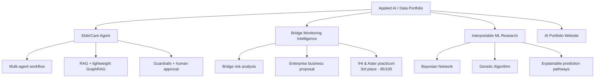
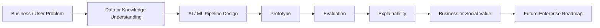

# Hi, I'm Ami 👋

## Applied AI / Data Talent in Development

I am a Digital Business & Innovation student learning advanced technologies to digitalize business operations and solve real business problems.

My current focus and developing pathway are **Data Analytics, AI for Positive Computing, AI Agents, Explainable AI, and Enterprise Digital Transformation**.

I want to connect **business problems, data, AI systems, psychology, and ethics** to create practical and explainable AI solutions.

---

## Technical Skills

### AI / Data / Machine Learning

### RAG / AI Agents / Prototyping

### Business / Research Tools

---

## My Learning Journey

### 1. Year 1 — Technical Foundation
**Learning:** Python, R, Computer Networking  
**Built:** Basic programming, statistical thinking, and networking foundation.

---

### 2. Year 2 — Data & Business Foundation
**Learning:** Statistics, Mathematics, Business Principles, Database, Big Data  
**Built:** Data analysis foundation and business problem understanding.

---

### 3. Career Practicum — Enterprise Problem Experience
**Project:** IHI & Aster internship-based project  
**Role:** Data analyst  
**Work:** Bridge risk analysis and business proposal development  
**Result:** Team ranked **3rd** and received **95/100**  
**Built:** Understanding of enterprise business problems, infrastructure risk, and data-driven proposal design.

---

### 4. Turning Point — AI Ethics & Explainable AI
**Course:** AI & Intelligent Product Development  
**Built:** Interest in AI ethics, Explainable AI, and human-centered AI systems.

---

### 5. Year 3 / Early Graduation — Research Direction
**Research:** Bayesian Network + Genetic Algorithm for interpretable machine learning  
**Status:** CIDM 2026 paper submitted; result pending  
**Built:** Research direction in interpretable ML and probabilistic reasoning.

---

### 6. Current Focus — Applied AI / Data
**Learning:** Mining Unstructured Data, Business Analytics & AI, Customer Analytics & AI, Generative AI  
**Direction:** Applied AI for business digitalization, positive computing, and ethical AI solutions.

---

## Featured Projects

### Safe Multi-Agent ElderCare Assistant
**Role:** Individual project  
**Focus:** Hybrid routing, RAG, lightweight GraphRAG, memory, guardrails, caregiver escalation, and technical trace  
**Value:** Supports elderly users with safer, explainable next-step guidance.

### Bridge Monitoring Intelligence
**Role:** Collaborated project / IHI & Aster Career Practicum  
**Focus:** Bridge risk analysis, inspection prioritization, and business proposal  
**Result:** Data analyst role. Team ranked **3rd** and received **95/100**.

### Interpretable ML Research: Bayesian Network + Genetic Algorithm
**Role:** Collaborated research project / thesis direction  
**Focus:** Interpretable machine learning, probabilistic reasoning, and explainable prediction pathways  
**Status:** Paper submitted to **CIDM 2026**; result pending.
---

<b>Other Class Projects</b>

 

| Project | Role | Focus | Result |
|---|---|---|---|
| **Restaurant Review Intelligence** | Class project | NLP, TF-IDF, model comparison, target leakage prevention, explainability | Built a review intelligence pipeline to detect negative reviews and extract complaint patterns. |
| **Student Success Prediction** | Class project | ML pipeline, feature engineering, recall-focused evaluation, business interpretation | Built an at-risk student prediction pipeline for early intervention support. |

---

## My AI Project Pattern

---

## Development Approach

I am still developing my coding depth, and I use a structured, AI-assisted development approach to build readable AI/Data prototypes.

My current strengths are:
- understanding business or user problems,
- designing AI/ML workflows,
- researching suitable technical patterns,
- building readable prototypes,
- documenting architecture,
- evaluating model behavior,
- and explaining business value.

My next growth areas are:
- software engineering depth,
- testing,
- cloud deployment,
- security,
- monitoring,
- and production-level AI delivery.

---

## Current Direction

I want to connect **business problems, data, AI systems, psychology, and ethics** to create explainable and practical AI solutions.

My long-term goal is to become an **Applied AI Engineer and Researcher** who can solve business and social problems with AI ethically and effectively.
